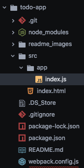

Here we create a to-do app built with the React JavaScript library.

This app is based upon the tutorial by NetNinja which you can find [here](https://www.youtube.com/watch?v=yZ0f1Apb5CU&list=PL4cUxeGkcC9i0_2FF-WhtRIfIJ1lXlTZR).

There is a lot to install upfront to start working with react, let's work our way through the installations.

You need node.js installed on your machine. Find it [here](https://nodejs.org/en/download/).

Let's make a repository on GitHub where we can keep all our versions of this app. In the clone/download we need to copy the remote repository url for pasting into the terminal in a few steps time.

Then, git from our terminal, git clone the GutHub repository.

```
git clone git@github.com:danhagg/todo-app.git
```

1. Add all of our files
2. Commit all our files with a message
3. Paste in the destination we copied from gitgub for the remote repository
4. Then push the current folder to GitHub


```
git add .
git commit -m"First commit"
git remote add origin git@github.com:danhagg/todo-app.git
git push -u origin master
```

Now we have our local and GitHub master up-to-date and synced with each other we can make a new local version of the app to play with and make mistakes on whilst keeping our master version safe.

Let's create a new branch
and start working on it
```
git branch v0.1
git checkout v0.1
```

### v0.1 - Prep (an annoying amount of it too)
Add `/dist` to `.gitignore` file

Make an `html` file in the `src` folder with the following...

```html
<!DOCTYPE HTML>
<html>

<head>
  <meta charset="utf-8" />
  <title>React - ToDo List</title>
</head>

<body>
  <div id="app"></div>

  <script src="/app/bundle.js"></script>
</body>
</html>
```

Then in the terminal we need to initialize our repo to use node packages. The following initializes a `package.json` file to keep track of all our dependencies. Agree to all, add license 'MIT'.
```
npm init
```

Need to install install `react` and `react-dom`
```
npm install react react-dom --save
```

Install all `babel` packages as development dependencies.
Then install webpack as a development dependency.
```
npm install babel-core babel-loader babel-preset-es2015 babel-preset-react --save-dev
npm install webpack webpack-dev-server --save-dev
```

Create `webpack.config` file to root of the todo-app folder. This file will control how `babel` converts `JSX/ES2015` into JavaScript and where to output that JavaScript. Add following to `webpack.config` file.

```js
// node.js path module assigned to path variable
var path = require('path');

//all our web settings for webpack assigned to module.exports
// looks for all .js in src and combines into single file for reducing http requests
// transform jsx in JS, and look at css files.
module.exports = {
  // look in current/src/app/index.js for root .js file
    entry: path.resolve(__dirname, 'src') + '/app/index.js',
    output: {
        path: path.resolve(__dirname, 'dist') + '/app',
        filename: 'bundle.js',
        publicPath: '/app/'
    },
    module: {
        loaders: [
            {
                test: /\.js$/,
                include: path.resolve(__dirname, 'src'),
                loader: 'babel-loader',
                query: {
                    presets: ['react', 'es2015']
                }
            },
            {
                test: /\.css$/,
                loader: 'style-loader!css-loader'
            }
        ]
    }
};
```
create a new file `index.js` in a new folder called `app` in `src` folder. You're directory structure should look something like this!



  Add to `scripts` in the the `package.json` file so we can run a bunch of stuff with a few simple commands.

  ```json
  "start": "npm run build",
  "build": "webpack -d && webpack-dev-server --content-base src/ --inline --hot --port 5000"
  ```

Add to `index.html`, inside the `body` elements
```html
  <script src="/app/bundle.js"></script>
```
The entirety of the app will be compiled and delivered into `bundle.js`.

To `index.js` add `alert('it works');`
Remember that `index.js` and all other `.js` files (and their JSX/JS contents) feed into and are compiled to the `dist/app/bundle.js` file which, shown above, is passed into the in `index.html`.

Run with `npm start` in the terminal and check `localhost:5000`. You should see the alert you coded in the `index.js`.

OK, thats a lot of prepping just to get an alert on the screen, but lets push our v0.1 to github and move onto v0.2 where we can start some proper app development.

```
git add -A
git commit -m"development tools set up"
git push --set-upstream origin v0.1
```

On github repository, Make a new pull request (compare master to v0.1), merge pull request.

Back in terminal change to and update your local master.
```
git checkout master
git pull
```

Create and change to `v0.2` for continuing development off the `master` branch.

```
git branch v0.2
git checkout v0.2
```

### v0.2 Components (Here we go...)
Most of the react code is made up of components.
We shall start the ToDo app with making a ToDo component.
Clear the `src/app/index.js` file of contents.

```
var React = require('react');

// react DOM module
var ReactDOM = require('react-dom');

// Create component
// ES6 way or React way. This way is ES6??
class ToDo extends React.Component {
  render () {
    return (
      <div>
        <h1>Should I stay?</h1>
        <p>Or should I go now?</p>
      </div>
    );
  }
}

// Put component into html with react DOM module
// And output to the index.html to the handle app
const app = document.getElementById('app');
ReactDOM.render(<ToDo />, app);
```

The webpack should compile the `index.js` code, to vanilla JavaScript in `bundle.js` and and produce the output to the `div` with the "id=app" as webpage on `localhost:3000`.

To debug go to chrome web store, search 'React Developer Tools' or follow the link [here](https://chrome.google.com/webstore/detail/react-developer-tools/fmkadmapgofadopljbjfkapdkoienihi?hl=en) and 'add to chrome'. Now, when we inspect the web page (Right click, inspect) a React tab appears and we can view our components (if they are on the current web page/ try facebook) in the browser.

Push new component to github
```
git add -A
git commit -m"first component"
git push --set-upstream origin v0.2
```

On github, Make new pull request, compare master vs v0.2, confirm merge.

Back on your local repository
```
git checkout master
git pull
git branch v0.3
git checkout v0.3
```
### Props
`Props` allow us to pass data into our components which we can display on the web page. Used along with `states`.

To add props we can for the moment work on the `index.js` file.

We can declare const and var in the file. to access these variables we use `{this.props}` to obtain all the availbale properties in the component (such as `mssg` and `moreLyrics`)

```js
var React = require('react');
var ReactDOM = require('react-dom');

class ToDo extends React.Component {
  render () {
    return (
      <div>
        <h1>Should I stay?</h1>
        <p>Or should I go now?</p>
        <p>{this.props.mssg}</p>
        <p>{this.props.moreLyrics.first}</p>
        <p>It will be {this.props.moreLyrics.second}</p>
      </div>
    );
  }
}

var more = {first: 'If I stay', second: 'double'}

const app = document.getElementById('app');
ReactDOM.render(<ToDo const mssg = "If I go there will be trouble!" moreLyrics={more} />, app);
```
